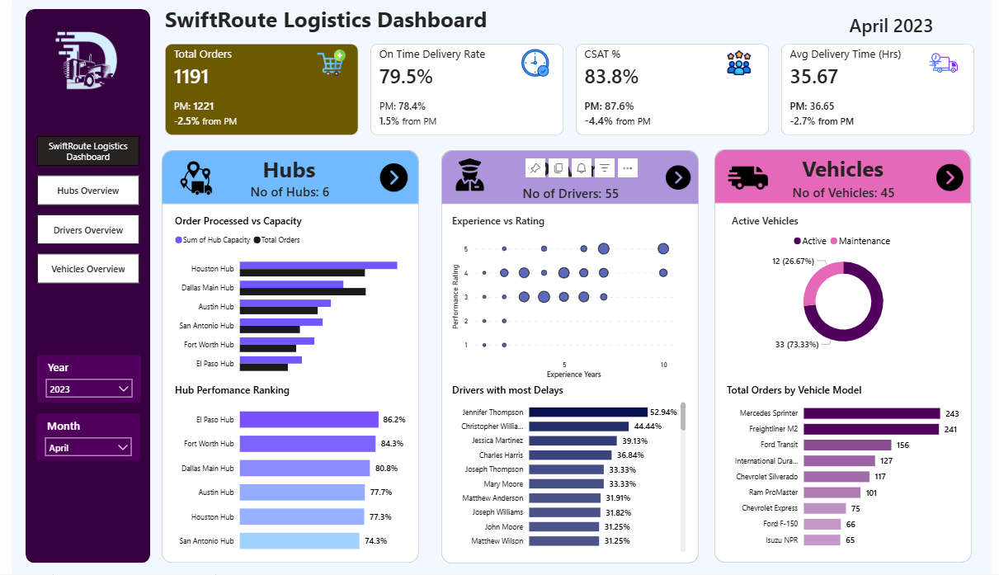
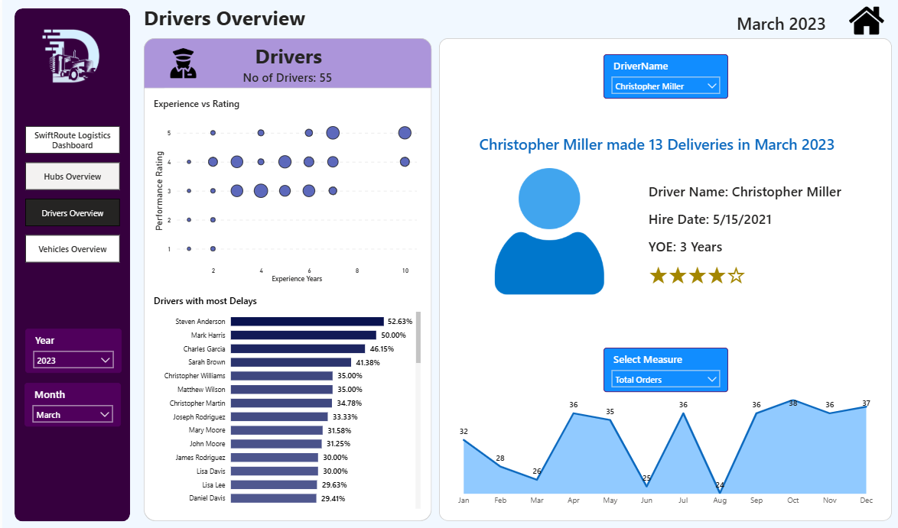
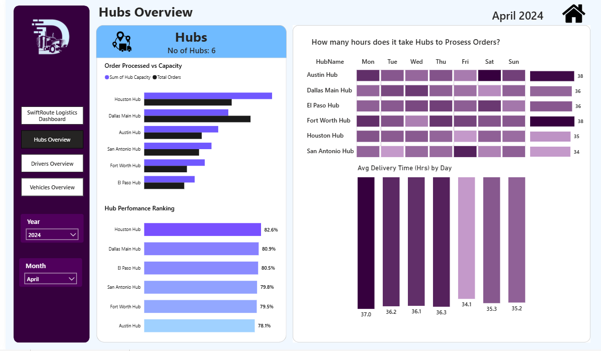
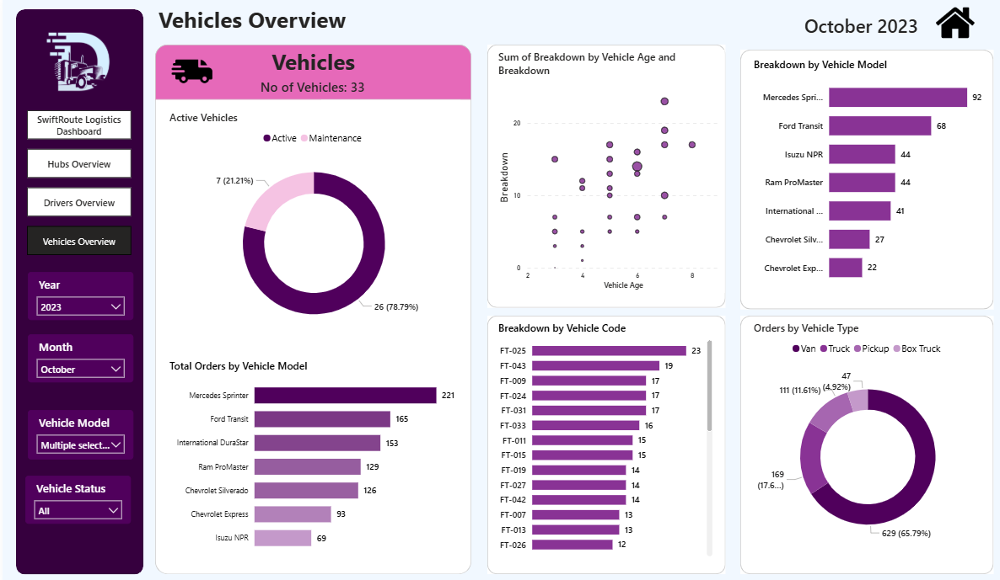

# 🚛 SwiftRoute Logistics Dashboard (Power BI)

A comprehensive **Power BI dashboard project** designed to analyze and monitor logistics operations including **orders, drivers, hubs, and fleet vehicles**.  
The dashboard transforms raw logistics data into actionable insights that help improve **delivery performance, fleet utilization, and operational efficiency**.

---

# 📊 Project Overview

Managing logistics operations involves coordinating **drivers, hubs, vehicles, and thousands of deliveries**. This project demonstrates how **data analytics and visualization** can simplify complex transportation data and support **data-driven decision making**.

The **SwiftRoute Logistics Dashboard** analyzes more than **27,000 logistics records** to provide insights into:

- Delivery performance
- Fleet utilization
- Driver productivity
- Hub capacity management
- Operational efficiency

The dashboard is built entirely in **Microsoft Power BI** using a **star schema data model**, interactive visuals, and dynamic filters.

---

# 🎯 Project Objectives

The main objectives of this project are:

- Transform large logistics datasets into meaningful business insights
- Track **key logistics KPIs**
- Monitor **driver performance and delays**
- Evaluate **hub capacity and operational efficiency**
- Analyze **vehicle fleet usage and maintenance status**
- Provide **interactive dashboards** for operational decision making

---

# 🗂️ Dataset Description

The project uses a structured logistics dataset consisting of a **fact table and multiple dimension tables**.

### Fact Table
**Orders Table**

Contains detailed order and delivery information.

| Column | Description |
|------|-------------|
| Order ID | Unique identifier for each order |
| Order Date | Date of order placement |
| Delivery Date | Date order was delivered |
| Hub ID | Hub responsible for processing |
| Driver ID | Assigned delivery driver |
| Vehicle ID | Vehicle used for delivery |
| Delivery Time | Time taken for delivery |
| Delivery Status | Delivered / Delayed |
| Customer Rating | Customer satisfaction score |

Total rows: **27,000+**

---

### Dimension Tables

**Drivers Table**

| Column | Description |
|------|-------------|
| Driver ID | Unique driver identifier |
| Driver Name | Driver full name |
| Hire Date | Date driver joined |
| Experience Years | Driver experience |
| Performance Rating | Driver performance score |

---

**Vehicles Table**

| Column | Description |
|------|-------------|
| Vehicle ID | Unique vehicle identifier |
| Model | Vehicle model |
| Vehicle Age | Age of vehicle |
| Status | Active / Maintenance |

---

**Hubs Table**

| Column | Description |
|------|-------------|
| Hub ID | Unique hub identifier |
| Hub Name | Name of logistics hub |
| Hub Capacity | Maximum order processing capacity |

---

# 🧠 Data Model

The dashboard follows a **Star Schema Data Model**.

**Fact Table**
- Orders

**Dimension Tables**
- Drivers
- Vehicles
- Hubs
- Date Table

Relationships:

```
Drivers   ─┐
Vehicles  ─┼── Orders (Fact Table)
Hubs      ─┘
Date Table ─ Orders
```

This model allows efficient filtering and cross-analysis across dashboards.

---

# 📈 Key Performance Indicators (KPIs)

The executive dashboard tracks the following KPIs:

| KPI | Description |
|----|-------------|
| Total Orders | Total number of deliveries |
| On-Time Delivery Rate | Percentage of deliveries completed on time |
| Customer Satisfaction (CSAT) | Average customer rating |
| Average Delivery Time | Average time taken for deliveries |

---

# 📊 Dashboard Pages

## 1️⃣ Executive Dashboard

Provides a **high-level operational overview**.

Key Insights:

- Total orders processed
- On-time delivery performance
- Customer satisfaction score
- Average delivery time
- Hub performance summary
- Driver delays
- Fleet utilization

This page is designed for **executive-level monitoring**.

---

## 2️⃣ Hubs Overview

Analyzes hub operational performance.

Key Visuals:

- **Orders Processed vs Hub Capacity**
- **Hub Performance Ranking**
- **Daily Processing Time Heatmap**
- **Average Delivery Time by Day**

Business Insights:

- Identify **underperforming hubs**
- Detect **capacity bottlenecks**
- Analyze **daily operational load**

---

## 3️⃣ Drivers Overview

Evaluates driver productivity and performance.

Key Visuals:

- **Experience vs Performance Rating (Scatter Plot)**
- **Drivers with Most Delays**
- **Driver Profile Card**
- **Monthly Delivery Trend**

Business Insights:

- Identify **high performing drivers**
- Monitor **drivers causing delays**
- Evaluate **impact of experience on performance**

---

## 4️⃣ Vehicles Overview

Tracks fleet utilization and health.

Key Visuals:

- **Active vs Maintenance Vehicles**
- **Orders by Vehicle Model**
- **Vehicle Age Analysis**

Business Insights:

- Monitor **fleet health**
- Identify **vehicle models used most frequently**
- Track **maintenance impact on operations**

---

# ⚙️ Features

✔ Interactive dashboard navigation  
✔ Dynamic filtering by **Year and Month**  
✔ Drill-down capabilities  
✔ Clean and intuitive UI  
✔ Data model optimized for performance  
✔ KPI tracking for operational monitoring  

---

# 🛠️ Tools & Technologies

- **Microsoft Power BI**
- **Power Query**
- **DAX (Data Analysis Expressions)**
- **Data Modeling (Star Schema)**
- **Data Visualization**
- **Excel / CSV Dataset**

---

# 📌 Example DAX Measures

### Total Orders

```DAX
Total Orders = COUNT(Orders[Order ID])
```

### On Time Delivery Rate

```DAX
On Time Delivery Rate =
DIVIDE(
    CALCULATE(COUNT(Orders[Order ID]), Orders[Delivery Status] = "On Time"),
    COUNT(Orders[Order ID])
)
```

### Average Delivery Time

```DAX
Avg Delivery Time =
AVERAGE(Orders[Delivery Time])
```

---

# 📷 Dashboard Preview

### Executive Dashboard


### Drivers Overview


### Hubs Overview


### Vehicles Overview


---

# 💡 Key Insights from the Dashboard

- Some hubs operate close to **maximum capacity**, indicating possible scaling needs.
- Certain drivers contribute significantly to **delivery delays**.
- A small number of vehicle models handle a large portion of deliveries.
- Delivery performance varies depending on **day of the week**.

---

# 🚀 Future Improvements

Possible enhancements include:

- Route optimization analysis
- Fuel cost analytics
- Predictive delivery delay modeling
- Real-time logistics tracking
- Integration with GPS data
- Driver incentive performance tracking

---

# 🙌 Acknowledgements

Special thanks to my **mentor/instructor** for guidance and support in learning **Power BI, data modeling, and dashboard development** which helped bring this project to life.

---

# 📬 Connect With Me

If you like this project or want to collaborate, feel free to connect with me on **LinkedIn** -www.linkedin.com/in/kishoree23.

---

⭐ If you found this project helpful, consider **starring the repository**!
